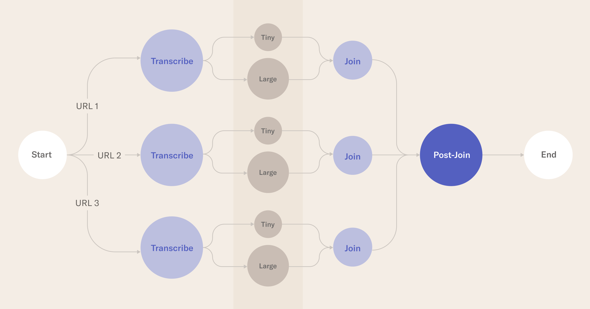

# OpenAI Whisper on Metaflow 👋

This repository will help you optimize Open AI's [Whisper](https://github.com/openai/whisper) in workflows run on the [Outerbounds Platform](https://outerbounds.com/blog/announcing-outerbounds-platform/). It builds on our earlier repository to help you [Get started with Whisper and Metaflow](https://github.com/outerbounds/whisper-metaflow). This implementation focuses on using Kubernetes resources to unlock new levels of scale and processing throughput. 

 </img>

## Repository Overview

| File           | Description |
|------------------|-------------|
| [Dockerfile](./Dockerfile)   | Dockerfile to create a docker image for running OpenAI Whisper |
| [Makefile](./Makefile)   | Makefile for building the docker image |
| [youtube\_video\_transcriber.py](./youtube_video_transcriber.py)   | CLI tool for creating a transcript of a given YouTube URL and given model |
| [whisper_flow.py](./whisper_flow.py) | Metaflow flow for creating transcripts of using whispers tiny and large models |

# Run the flow ▶️

 </img>

## Running with Kubernetes resources
To unleash the power of the cloud with [Metaflow's Kubernetes decorator](https://docs.metaflow.org/scaling/remote-tasks/kubernetes), run this command from your terminal. 

This uses an already built Docker image ready for running this flow.

```
$ python3 whisper_flow.py run --with kubernetes:image=public.ecr.aws/outerbounds/whisper-metaflow:latest
```

# Customizing flow dependencies ⚙️

This section assumes you have Docker setup and running locally. If you don't have Docker installed, please follow the instructions [here](https://docs.docker.com/get-docker/). If there are other packages to be installed or changes to be made in existing ones, update the Dockerfile.

## Create the docker image
With Docker running, build the image specified in the `./Dockerfile`. 

```
$ make build
...
 => => writing image sha256:23be1b523a3404d8bee8e4c8ac29f7160ac7ad7090d48c567010a34cb9f2666e                                                           0.0s
 => => naming to docker.io/library/whisper-metaflow                                                                                                    0.0s
```

## Tag and push the docker image to a repository.
Then tag the resultant image and push it to an image registry. In this example, we are using GitLab's container registry.
```
$ docker tag sha256:23be1b523a3404d8bee8e4c8ac29f7160ac7ad7090d48c567010a34cb9f2666e whisper-metaflow:latest
...

$ docker push whisper-metaflow
```

## Run the flow with customized image

```
$ python3 whisper_flow.py run --with kubernetes:image=whisper-metaflow:latest
```

## Run the flow with customized image and changed CPU/Memory resources

```
$ python3 whisper_flow.py run --with kubernetes:image=whisper-metaflow:latest,cpu=4,memory=8192
```

## Alternate approach
Instead of running the flow with cli options above, you could also change the whisper_flow.py file and add the `@kubernetes` decorator to appropriate steps and then simply run the flow as:

```
$ python3 whisper_flow.py run
```
  
# Get Help 🤗
Please join us on [Slack](http://slack.outerbounds.co/) if you have questions about getting setup. The Metaflow community is responsive and happy to help!
